### Introduction :
This tutorial shows how to deploy Dapr in a Kubernetes cluster using Meshery Playground. You'll deploy a Python app for message generation and a Node app for consumption and persistence, following the classic Hello World example with Dapr. Let's dive in and explore the architecture diagram that illustrates this setup.

### Prerequisites:
- Basic understanding of containerization , Kubernetes concepts and basic knowledge of Dapr .
- Access to the _Meshery Playground_. If you don't have an account, sign up at [Meshery Playground](https://meshery.layer5.io/).

### Lab Scenario:
You will be deploying `Hello Kuberentes` applicationswith the help of `Meshery Playground` which has  Python App that generates messages and the Node app consumes , persists them.

### Learning Objective:
Upon completing this tutorial, you will:
- Deploy Hello Kubernetes with  Dapr using Meshery Playground.
- Implement a Python app for message generation and a Node app for consumption and persistence with Dapr.
- Explore Dapr's features for service invocation, state management, and application observability in Kubernetes.

### Steps:

#### Access Meshery Playground
   - Log in to the [Meshery Playground](https://meshery.layer5.io/) using your credentials. On successful login, you should be at the dashboard. Press the **X** on the _Where do you want to start?_ popup to close it (if required).
   - Click **Explore** in the Cloud Native Playground tile to navigate to _MeshMap_.

> **_NOTE:_**  MeshMap is still in beta.

#### Step 1 - Install Dapr on your meshery playground 

- Refer to the Meshery Playground documentation for instructions on importing Helm charts: [Meshery Playground Helm Docs](https://docs.layer5.io/meshmap/getting-started/starting-helm/)
- 
  Specific to Dapr ,To import Dapr  use the direct download link: [Dapr Helm Chart](https://artifacthub.io/packages/helm/dapr/dapr?modal=install).


#### Step 2 - Create and configure a Reddis state store

Dapr can use a number of different state stores (Redis, CosmosDB, DynamoDB, Cassandra, etc) to persist and retrieve state. This demo will use Redis.
1. Follow [these steps](https://docs.dapr.io/getting-started/tutorials/configure-state-pubsub/#step-1-create-a-redis-store) to create a Redis store.
2. Once your store is created, add the keys to the `redis.yaml` file in the `deploy` directory.
   > **Note:** the `redis.yaml` file provided in this quickstart will work securely out-of-the-box with a Redis installed with `helm install bitnami/redis`. If you have your own Redis setup, replace the `redisHost` value with your own Redis master address, and the redisPassword with your own Secret. You can learn more [here](https://docs.dapr.io/operations/components/component-secrets/).
3. Apply the `redis.yaml` file and observe that your state store was successfully configured!
4. Here is reddis.yaml file you can refer -
 ```\yaml
apiVersion: dapr.io/v1alpha1
kind: Component
metadata:
  name: statestore
spec:
  type: state.redis
  version: v1
  metadata:
  # These settings will work out of the box if you use `helm install
  # bitnami/redis`.  If you have your own setup, replace
  # `redis-master:6379` with your own Redis master address, and the
  # Redis password with your own Secret's name. For more information,
  # see https://docs.dapr.io/operations/components/component-secrets .
  - name: redisHost
    value: redis-master:6379
  - name: redisPassword
    secretKeyRef:
      name: redis
      key: redis-password
auth:
  secretStore: kubernetes
```

5. In the left sidebar, click on the upward arrow symbol(import icon) to import the designs into Meshery.
   
6. In the modal that appears:
   - Enter a name for your design in the "Design File Name" field (e.g.`Hello kubernetes -main`).
   - Select `Kubernetes Manifest` from the "Design Type" dropdown menu.
        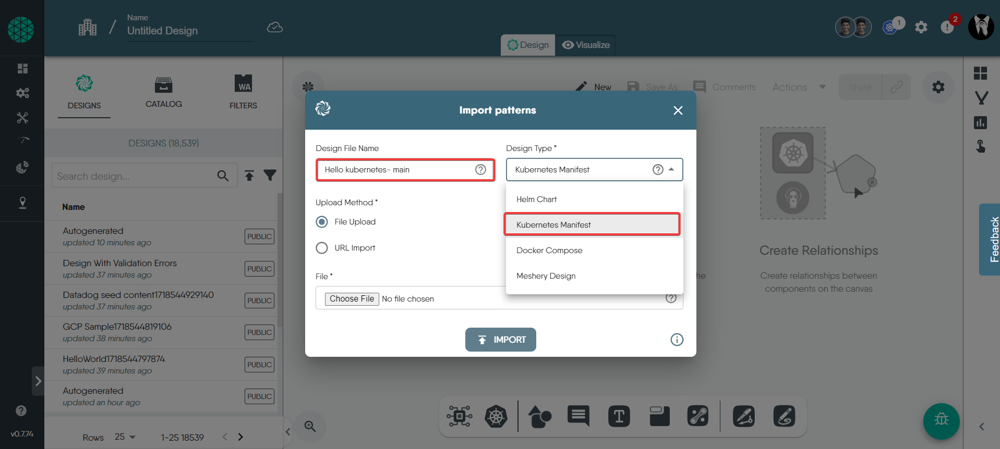

7.
  - Choose `File Upload` for the upload method, and select [this](https://github.com/dapr/quickstarts/blob/master/tutorials/hello-kubernetes/deploy/redis.yaml) file you just downloaded.
   - Then, click on `Import`
     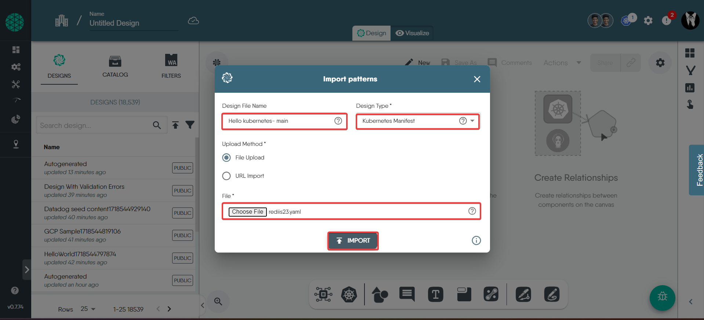

8. Under the "Designs" tab, you will see that we have successfully imported the `Hello kubernetes -main` design.
   - now click on `actions` on left side of canvas and click on `deploy` to continue
     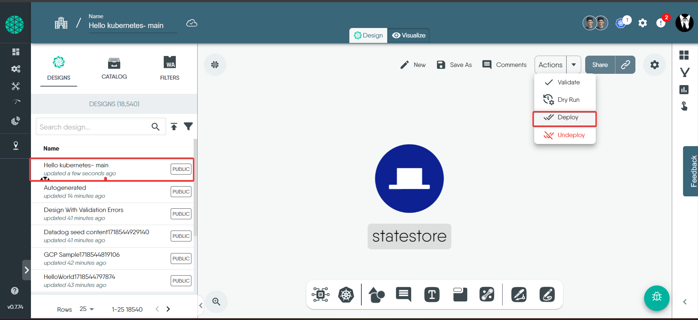
   - Select your environment , to know more about this refer [docs](https://docs.meshery.io/concepts/logical/environments)
      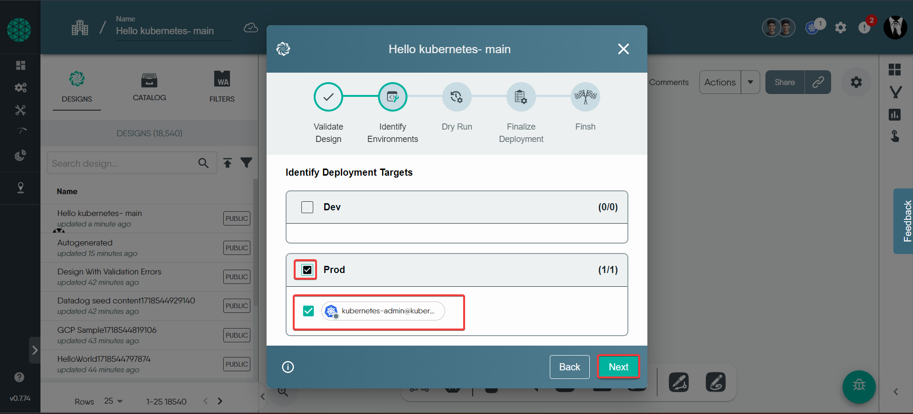
.9 Click on `Deploy` on canvas
    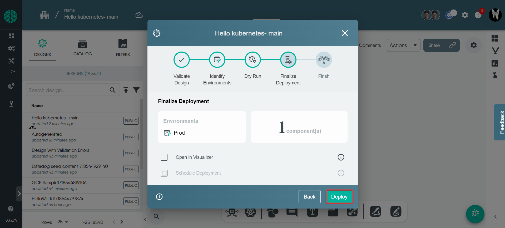
     
      

  

#### Step 3 - Deploy the Node.js app with the Dapr sidecar

In this step we will  deploy the Node.js app to Kubernetes. The Dapr control plane will automatically inject the Dapr sidecar to the Pod. If you take a look at the `node.yaml` file, you will see how Dapr is enabled for that deployment:
```\yaml
kind: Service
apiVersion: v1
metadata:
  name: nodeapp
  labels:
    app: node
spec:
  selector:
    app: node
  ports:
  - protocol: TCP
    port: 80
    targetPort: 3000
  type: LoadBalancer

---
apiVersion: apps/v1
kind: Deployment
metadata:
  name: nodeapp
  labels:
    app: node
spec:
  replicas: 1
  selector:
    matchLabels:
      app: node
  template:
    metadata:
      labels:
        app: node
      annotations:
        dapr.io/enabled: "true"
        dapr.io/app-id: "nodeapp"
        dapr.io/app-port: "3000"
        dapr.io/enable-api-logging: "true"
    spec:
      containers:
      - name: node
        image: ghcr.io/dapr/samples/hello-k8s-node:latest
        env:
        - name: APP_PORT
          value: "3000"
        ports:
        - containerPort: 3000
        imagePullPolicy: Always
```
`dapr.io/enabled: true` - this tells the Dapr control plane to inject a sidecar to this deployment.

`dapr.io/app-id: nodeapp` - this assigns a unique id or name to the Dapr application, so it can be sent messages to and communicated with by other Dapr apps.

`dapr.io/enable-api-logging: "true"` - this is added to node.yaml file by default to see the API logs.

1. Import [this](https://github.com/dapr/quickstarts/blob/master/tutorials/hello-kubernetes/deploy/node.yaml) file into meshery playground .
    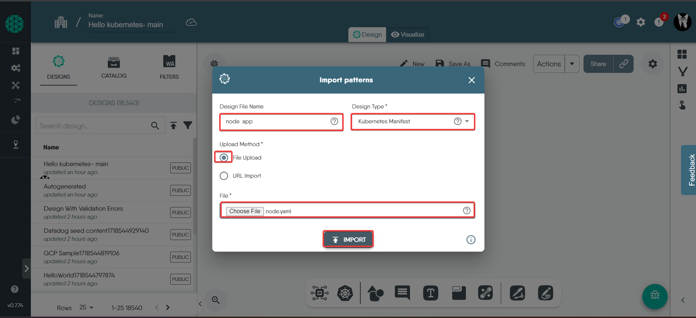
2. `Drag and Drop` nodeapp design to `Hello kubernetes-main` ,so that merging designs happen properly .
    
   - Click on `Merge`to merge designs.
      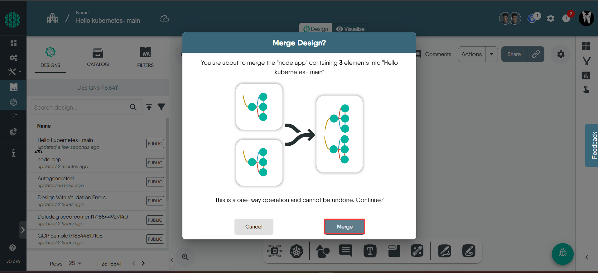
         

### Step 4 - Deploy the Python app with the Dapr sidecar  

Next, take a quick look at the Python app which has kubernetes manifest as :
```\yaml
apiVersion: apps/v1
kind: Deployment
metadata:
  name: pythonapp
  labels:
    app: python
spec:
  replicas: 1
  selector:
    matchLabels:
      app: python
  template:
    metadata:
      labels:
        app: python
      annotations:
        dapr.io/enabled: "true"
        dapr.io/app-id: "pythonapp"
        dapr.io/enable-api-logging: "true"
    spec:
      containers:
      - name: python
        image: ghcr.io/dapr/samples/hello-k8s-python:latest
```

At a quick glance, this is a basic Python app that posts JSON messages to `localhost:3500`, which is the default listening port for Dapr. You can invoke the Node.js application's `neworder` endpoint by posting to `v1.0/invoke/nodeapp/method/neworder`. The message contains some `data` with an orderId that increments once per second:

```python
n = 0
while True:
    n += 1
    message = {"data": {"orderId": n}}

    try:
        response = requests.post(dapr_url, json=message)
    except Exception as e:
        print(e)

    time.sleep(1)
```
1. Import [pythonapp](https://github.com/dapr/quickstarts/blob/master/tutorials/hello-kubernetes/deploy/python.yaml) file into meshery playground .
 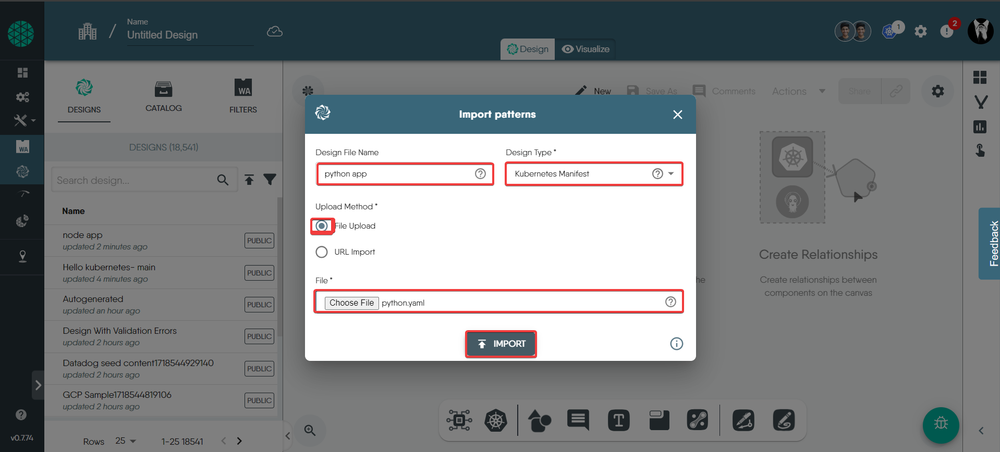
2. `Drag and Drop` pythonapp design to `Hello kubernetes-main` ,so that merging designs happen properly .
    
3.  Click on `Merge`to merge designs.
      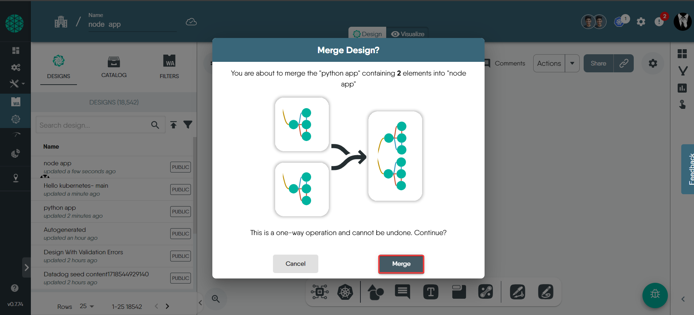
     
4. After succesfully importing all designs into meshery, On left side click on `actions`, then `deploy`to continue
      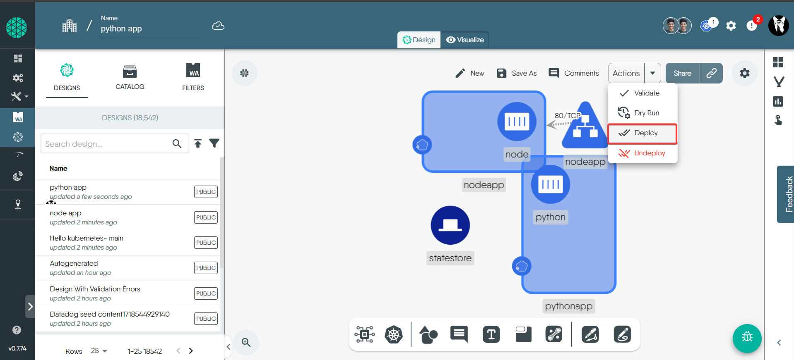
 5.Select your environment
      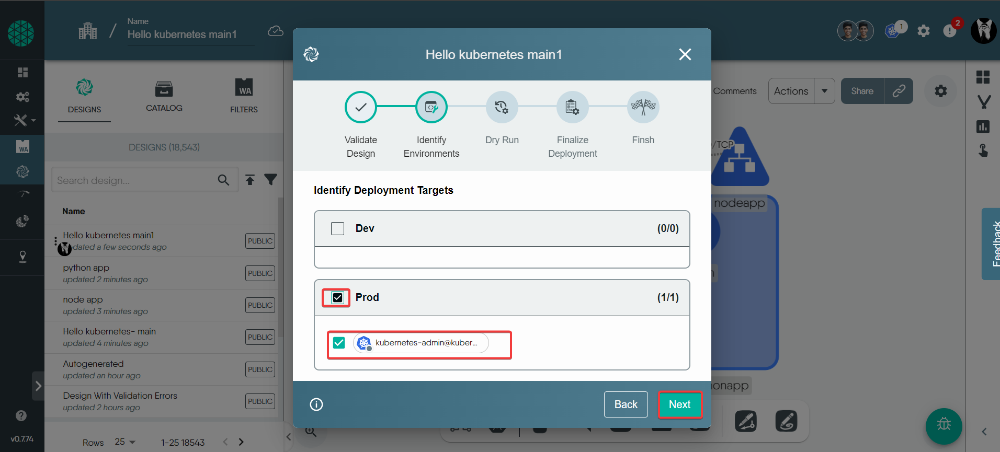
6. Click on `Deploy` at final stage, so that `Hello Kubenretes-main` is sucessfully deployed.
      
      

   
   


